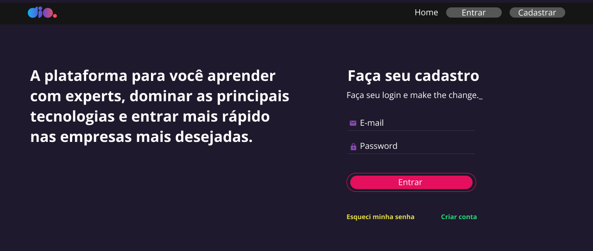
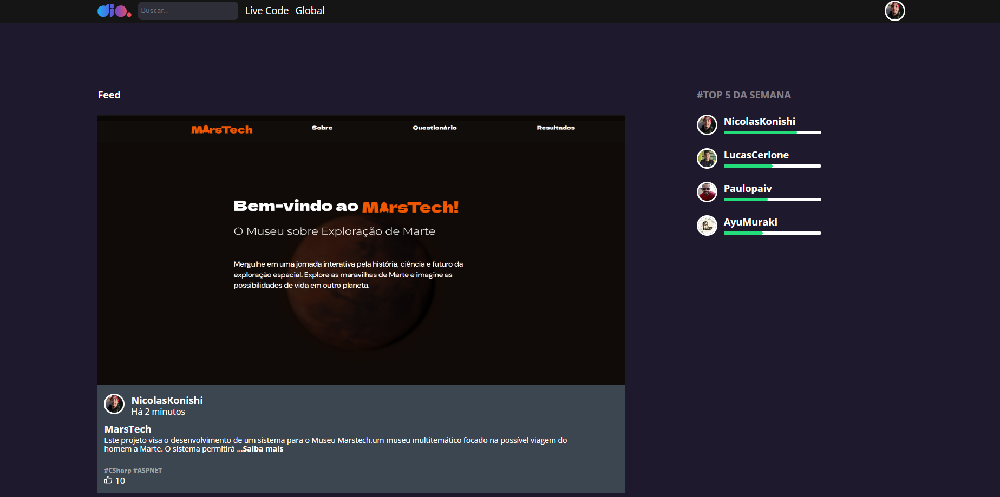
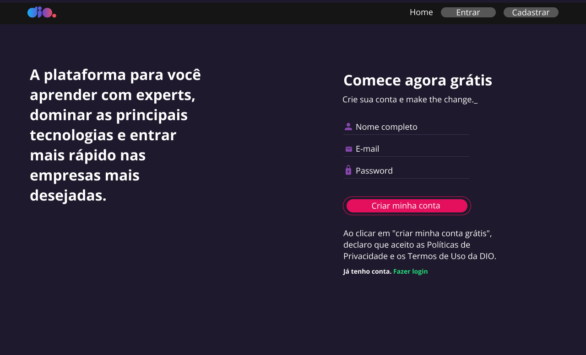

<h1 align="center">DIO Clone</h1>

  Projeto desenvolvido durante a formação React Developer, com o objetivo de demonstrar como implementar a navegação em uma aplicação React utilizando o React-Router-Dom.  

 

  

  

  

  

---

## 🚀 Tecnologias

Esse projeto foi desenvolvido com as seguintes tecnologias:

- HTML e CSS
- JavaScript
- React
- Figma
- Git e Github

---

## 💻 Projeto

O Projeto DIO Clone consiste em apresentar uma forma de navegar entre páginas em uma aplicação React, desenvolvendo um clone da plataforma DIO. 
Ele inclui páginas como Login, Home, Cadastro e a Home do usuário.

## 📑 Aprendizado

Durante o desenvolvimento deste projeto, utilizei o React-Router-Dom para implementar a navegação entre as páginas.  
Ademais, utilizei styled-components para a estilização da aplicação, facilitando o desenvolvimento e promovendo a reutilização de componentes. Também foi possível aplicar regras de estilização de forma mais eficiente.  
Para a navegação, utilizei o `useNavigate`, um hook nativo do React.

---

Feito por Nicolas Konishi
